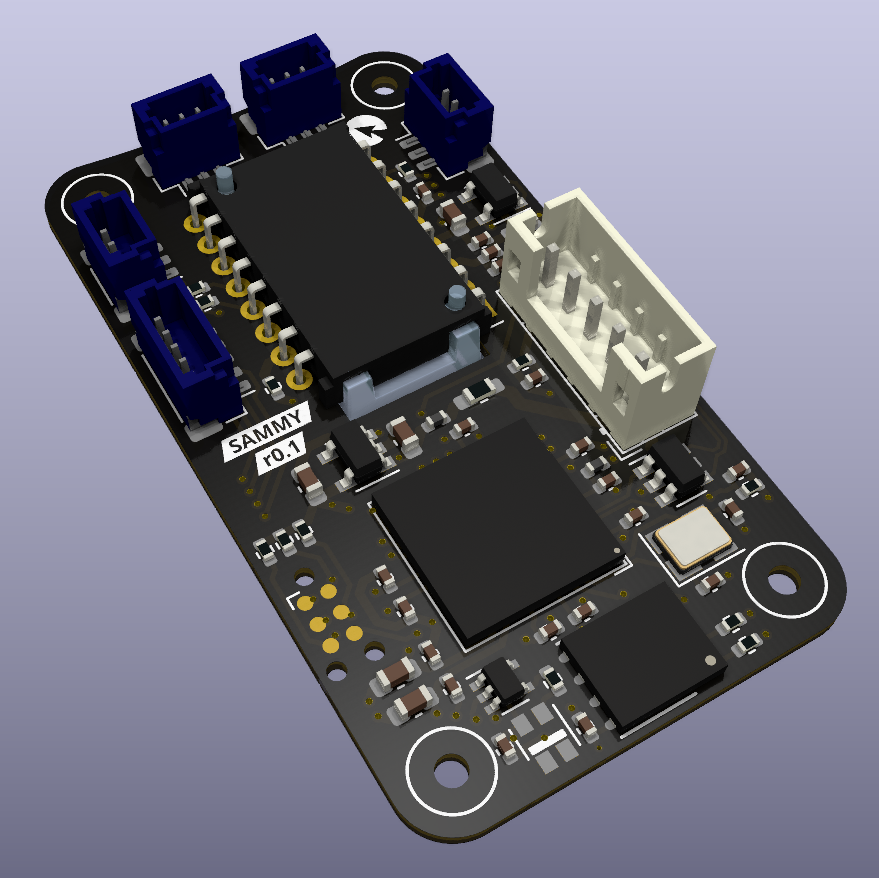

:hide-toc:

*****
sammy
*****
*sammy* is an open source wired mouse hardware implementation.

The little brother of *big-sammy_*

State of the project
====================

First prototype under testing, barebones firmware support for openinput_ under development.

.. admonition:: Roadmap

   - Initial design |:+1:|
   - First prototype manufactured and assembled |:+1:|
   - Tinyusb driver support |:hammer:|
   - Barebones firmware support |:hammer:|
   - Documentation |:hammer:|
   - Hardware improvements
   - First release

   ========== ================
   |:+1:|     Done!
   |:hammer:| Work in progress
   ========== ================

Specifications
==============

* 8 kHz sampling rate support
* Zero latency switch debounce
* Onboard configuration memory
* 2 main mouse buttons (satellite* configuration for both)
* 2 side buttons (symmetric to allow easy left/right handedness)
* encoder + wheel button (satellite* configuration)
* RGB Led

Hardware
========

* ATSAM3U MCU (ATSAM3UxC)
* Optical sensor [PMW3330, PMW3360, PMW3389, Truemove3]
* onboard conectors:
   * JST PH (2mm pitch) for USB
   * JST SH (1mm pitch) for stellite boards
* M2 mounting hardware

+--------------+
| USB   pinout |
+-----+--------+
| pin | func   |
+=====+========+
| 1 	| VCC    |
+-----+--------+
| 2 	| DM     |
+-----+--------+
| 3 	| DP     |
+-----+--------+
| 4 	| GND    |
+-----+--------+
| 5 	| Shield |
+-----+--------+

Peripheral boards are used for the buttons and encoder, available at generic-mouse-boards.

.. toctree::
   :caption: External Links
   :hidden:

   Source <https://github.com/openinput-fw/sammy>
   Firmware <https://openinput.readthedocs.io>
   Issue Tracker <https://github.com/openinput-fw/sammy/issues>

.. _big-sammy: https://big-sammy.readthedocs.io
.. _openinput: https://openinput.readthedocs.io
